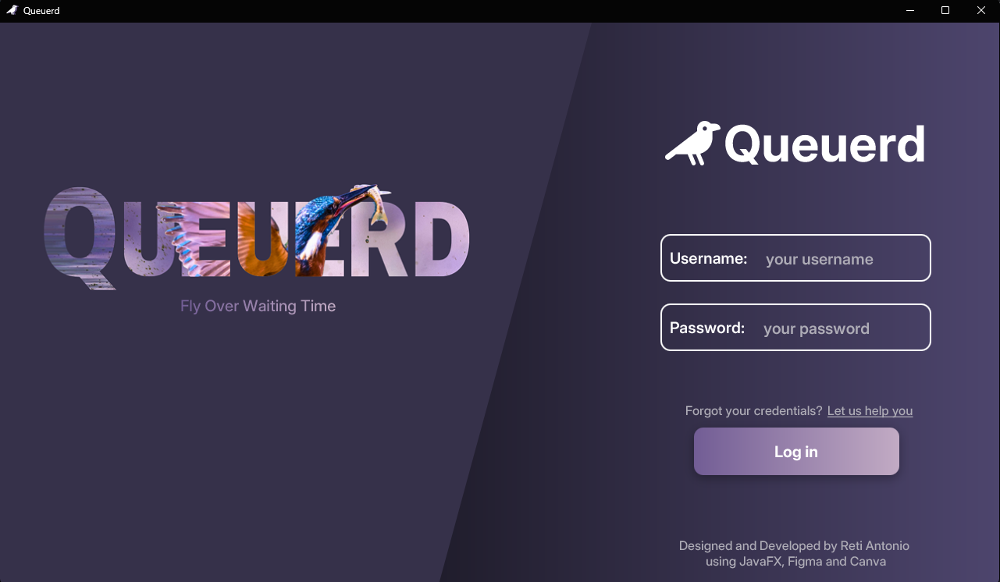
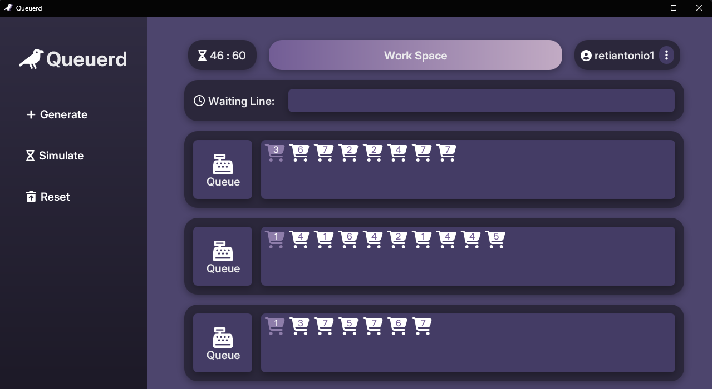
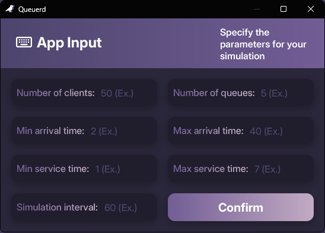
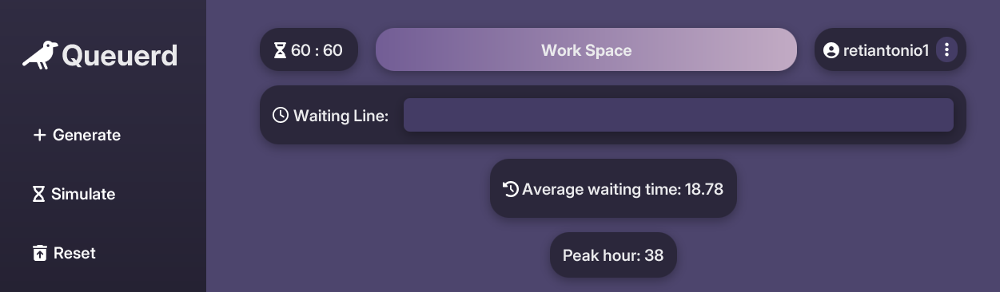

<h1>Queue Management App developed with Java and JavaFX</h1> 
Developed a full-stack queue management application with
Java backend and JavaFX frontend, implementing
multithreading for concurrent queue handling and the
Strategy design pattern to enable exible, customizable
queue processing strategies. Designed a responsive UI,
optimized backend performance, and ensured scalable,
maintainable architecture.

<h2>App Design / Screenshots</h2>

Designed using Figma and Canva.

<h3>Login Menu</h3>

<h3>Main Menu</h3>

<h3>Simulation Generator Menu</h3>

<h3>Results in Main Menu</h3>

